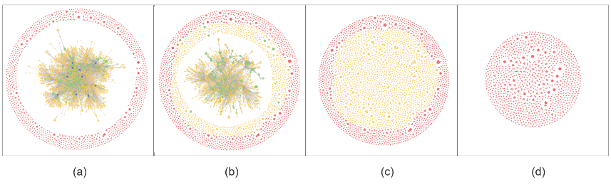

# 评估开发者在项目中的重要性

### 1、协作网络构建

​		基于开源社区开发者的行为事件数据，对于开发者协作网络进行抽取:

​		基于开发者在 GitHub 上的六种活动：提交 Issue，回复 Issue，提交 Pull Request (PR)，回复 PR，审查 PR 和合并 PR。以下是关键的步骤：

1. 开发者和他们的协作对象（即 Issues 和 PRs）形成一个二分图网络。在这个异构网络中，开发者和协作对象是两类节点，所有的连接都在这两类节点之间，不存在开发者之间或协作对象之间的连接。
2. 开发者通过他们的 actor_id 来区分，而他们所处理的 Issues 或 PRs 通过 issue_number 来区分。每个独特的 actor_id 或 issue_number 被视为网络中的一个节点。
3. 为了减少由机器人账号造成的噪声（因为它们会自动操作并关联大量的 Issues），通过查找帐号中的“-bot”、“-robot”和“[bot]”等关键词来识别并排除这些机器人账号。

​		在上图上部虚线框内，开源社区由开发者A、开发者B、开发者C及三个Issue（编号1，2，3）组成。开发者A创建了1号Issue，开发者B评论并向2号Issue提交PR，开发者C审查此PR并创建3号Issue以及与开发者B进行讨论。由此构成一个初步的二分图。

​		考虑到二分图分析复杂度，将其降维为同质网络。首先，将开发者与事件对象间不同类型的关系统一，只要开发者在事件对象上进行了6种规定行为之一，就形成连边。然后，如果两位开发者在同一事件对象上活跃，则这两位开发者形成了协作连边。这种连边的权重等于两者共同协作的事件对象数量。例如，开发者A和开发者B在1号Issue上共同活跃，产生权重为1的连边。开发者B和开发者C在2号和3号Issue上活跃，产生权重为2的连边，得到上图的下部虚线框。

### 2、开发者影响力评估

​		领导者在轨道模型中是关键开发者，对社区具有重要且深远的影响，有着强大的引导作用。为了定量度量节点影响力，需要构建可测量的指标，这些指标包括节点的点度中心性、介数中心性以及接近中心性。另外，如 PageRank 这样的特征向量中心性算法，提出的基于多属性决策和加权 LeaderRank 的影响力评估算法也能用于区分节点影响力的大小。

​		领导者通常通过对项目的高度贡献获得代码库的提交权限。在 GitHub，超过 88% 的项目的最关键开发者少于 16 人。因此，这里默认将影响力排名前10的开发者视为领导者，对于大型社区，可以根据需要增加领导者的数量。

#### 2.1   LeaderRank 算法

​		LeaderRank 算法在 PageRank 算法基础上进行了改进，得到的一种新的节点排序方式。PageRank 算法存在的问题：用于不连通的子网，网页的排名不一致。 

​		LeaderRank 算法针对此问题进行了改进，在网络中加入一个背景节点，让背景节点和网络中的每一个节点连接。由于背景节点的加入保证网络强连通性，解决了 PageRank 中节点排序和概率跳转的问题，并能够加快算法收敛的速度，最后， 背景节点的分值被均匀的分散到网络其他节点。 LeaderRank 计算方式：首先赋给背景节点 g 一个初始值 R~j~=0，然后原网络中 每一个节点都分配一个 Ri 值。根据节点度将 Ri 值平均分给邻居节点。整个过程 不断迭代，直到达到稳定状态，用 P~ij~ 表示随机游走过程：
}{u_i})
其中，i 和 j 代表节点，且 i, j=1,2,...,N+1，u~i~ 表示 i 节点的邻居节点数量，若 i 与 j 相连，则 β(ij) 为 1，否则为 0。
$$
R_k=\sum_{j=1}^{N+1}\frac{\beta(ij)}{u_i}R_j(k-1)
$$
​	其中，R~i~(k) 表示 i 节点经过 k 次迭代后的值，反复迭代 m 次后，R~i~ 收敛到一个稳定的值，记作：R~i~(m~c~)，最后把稳态后背景节点 g 的 R~g~(m~c~) 平均分配给其他节点。
$$
R_i=R_i(m_c)+\frac{N}{R_g(m_c)}
$$

 以下是VSCode项目中角色分类与识别效果：

|      | 1      | 2       | 3             | 4          | 5       | 6        | 7             | 8          | 9          | 10       |
| ---- | ------ | ------- | ------------- | ---------- | ------- | -------- | ------------- | ---------- | ---------- | -------- |
| PR   | mjbvz  | Tyriar  | gjsjohnmurray | meganrogge | isidorn | bpasero  | jrieken       | deepak1556 | sandy081   | alexdima |
| LR   | Tyriar | bpasero | isidorn       | mjbvz      | jrieken | sandy081 | gjsjohnmurray | alexdima   | roblourens | aeschli  |

